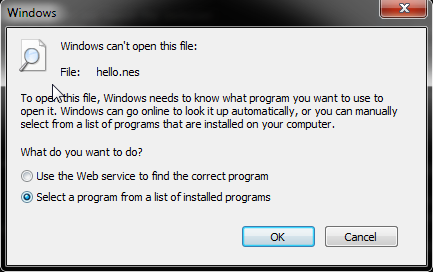
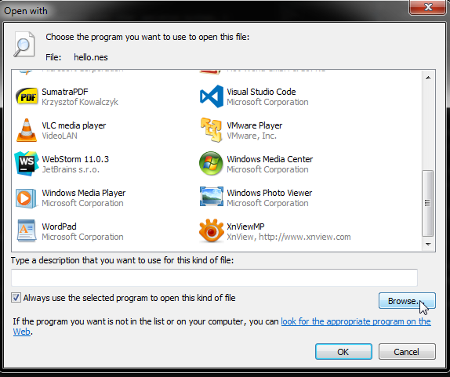

# Setting up your tools

You'll need a few tools to get started with NES Game development. I'll list them out, and detail what it is used for.
Make sure you have installed everything marked as **REQUIRED** before moving on to the next chapter.

**IMPORTANT NOTE**: _This tutorial is built entirely for Windows - while things may be compatible with other 
Operating Systems, they are not supported with this guide._

## Get the code!

**REQUIRED**

First, if you haven't already done so, get a copy of this repository. You may do this either by doing a `git clone` of
this repository, or downloading it as a zip file. *Using git is very strongly encouraged*. If you have not used it before,
[here is a decent introduction](https://www.git-tower.com/learn/git/ebook/en/command-line/basics/why-use-version-control).

If you decide to go this path, and you also decide to install Visual Studio Code (feel free to skip to that step lower
in this document, then come back!), you can press `ctrl+shift+p` then type in `git clone` to get some prompts to do it.
Visual Studio Code has a very good git integration, as well.

To download a zip file, go to this project's page on Github, and click the green `Clone or download` button at the top right.
This should get you to a download link.

You should also rename the folder from `nes-starter-kit` to the name of your game!

## Base tool zip

**REQUIRED**

To make life easier, most of the tools, including cc65 v2.14.0 (our c compiler), neslib (The library we use to interface with
the NES), and various converters are included in the following zip file: 

[Download Tools](http://cpprograms.net/devnull/nes_starter_kit_tools.zip)

Download this file, and extract it to the base folder within the `nes-starter-kit` folder. Once 
you have done that, follow the steps below. It will replace the `tools` folder and a few things in
it - that is expected and normal.

**REMINDER**: _This tutorial is built entirely for Windows - while things may be compatible with other 
Operating Systems, they are not supported with this guide._

## Cygwin, make, and unix tools

**REQUIRED**

These are some tools usually available on unix-based systems for building things. We mainly need the `make` command. 
You may not run this directly depending on your setup, but it is needed to build your NES rom.

To install this, go to the tools folder, and double-click `install_cygwin.bat`. This will download and launch the installer
for cygwin. You will need to go through the entire wizard - it just pre-selects some packages for you. Pick any url for the 
mirror when you get to that step; it does not matter.

**NOTE**: _The script isn't strictly necessary, but it selects the packages we need automatically, in addition to the defaults.
It is provided merely as a convenience. If you have cygwin installed already, make sure you have `make`, `wget` `chere`, and `curl`
installed._

## FCEUX (Or another NES Emulator)

**REQUIRED**

You will need an NES emulator to test your game! I typically use FCEUX, but you are welcome to use whatever you are comfortable
with. Mesen is another common option.

FCEUX is available here: http://www.fceux.com/

Next double click a rom in Windows explorer, then select your emulator to open it with once. This allows
the built-in tools to open your emulator of choice easily.

First, choose the "Select a program from a list of installed programs" option:

Make sure the "Always use the selected program to open this kind of file" checkbox is ticked, then click browse, and find the
emulator you downloaded: 

(Note: On Windows 10 you have to click `more apps`, scroll down and find `look for another app on this pc` instead.) 

If you don't do this, you won't be able to easily run your game with the `make run` command, or your IDE.

## Tiled

**REQUIRED**

Tiled is a tile editing tool for maps. We will be using it for designing our levels. It's similar to a paint program, but
with map tiles. We won't go into too much detail now; you can probably get by without it for a little while.

Get it here: http://www.mapeditor.org/

The tools are built for version 1.1.4, however later versions should also be fine.

## Famitracker

Famitracker is a music editing tool for the NES. We will use it to make music and sound effects for the
game. You don't have to download this right away if you don't want to; the built-in sound effects and 
music can probably cover you for a while!

## Visual Studio Code (Or other code editor)

You probably want a program to edit your code! I prefer VS Code, as it has a lot of powerful features for our use built in.

Get it here: https://code.visualstudio.com/

For best results, go to `file`, then `open folder`, and point it at your game's base folder. (Where `README.MD` is located.)

Of course, you are able to use another program such as vim or notepad++ if you prefer.

### Additional VS Code Tweaks

If you like using VS Code, there are some little things you can do to make it even better. 

#### Set built-in terminal to cygwin

If you have installed cygwin with the built-in script, this should just work. 

If you used a 32 bit cygwin, or did not install it in the default directory, you will have to tweak things slightly. 
Open `nes-starter-kit/.vscode/settings.json`, and change the setting `terminal.integrated.shell.windows` to wherever you 
installed cygwin. You will then have to also edit `nes-starter-kit/.vscode/tasks.json` to change the path used for 
`bash.exe`.

You will also have to press "OK" on a dialog asking if you want to run cygwin, based on project settings. Please do
this if you want builds to work!

**NOTE**: I've found that VS Code acts weird about cygwin bash the first couple times I try to build... if you run into
something similar, try closing VS Code and opening it again. You can also try opening one or two new tabs for your
terminal - the first one may be cmd, and the second one cygwin bash in the wrong directory. The third one worked,
and I stopped seeing issues.

#### Compile and run on pressing ctrl+shift+b

This is already set up for you too! You can change how this works by editing `nes-starter-kit/.vscode/tasks.json`.

#### Suggested VS Code Extensions

These extensions aren't required at all, but add features that could make development more pleasant. 
Check out the store pages, then make the call for yourself!

##### C/C++ (Miscrosoft)

This provides C and C++ syntax highlighting for VS Code. You probably want this one! To note, the application will suggest
installing this automatically when you open a `.c` or `.h.` file for the first time. You don't need to find this one
manually if you don't want to.

##### MADS (Jaromir Obr)

This is a 6502 assembly language support extension. You probably don't need it for most nes-starter-kit projects.
It will provide syntax highlighting for the raw assembly language in neslib, and some of our custom extensions.
You want this if you're planning on modifying or extending the guts of `nes-starter-kit`. If you'd prefer stick with C,
you can skip this.
