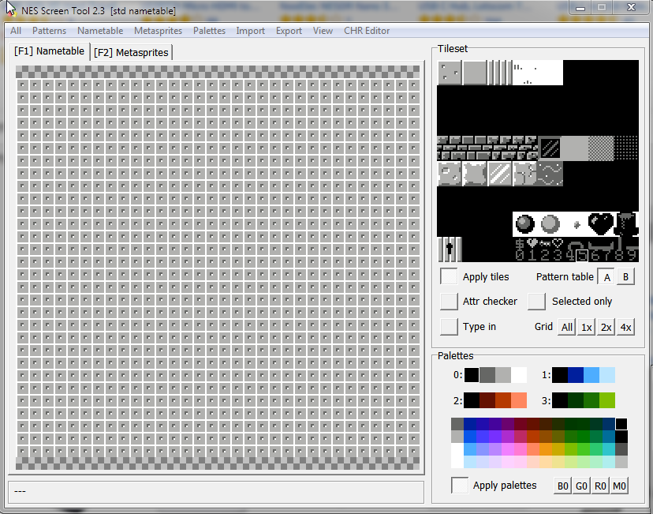

# Adding New Map Tiles

Adding new map tiles is fairly easy - all you will need is NES Screen Tool, (NESST) which
you likely installed in section 1. It should be in `tools/nesst`. 

Open the program up, and go to the Patterns menu, then select `Open chr`, then open
`graphics/tiles.chr`. You should now see the tiles for your game, but the colors may
look a little off. Next, select `Open Palettes` from the Palettes menu, then open
`graphics/palettes/main_bg.pal`. Now things should look more familiar.

The program is laid out with a big `[F1] Nametable` tab on the left, as well as a
`Tileset` with some settings on the top-right, and a `Palettes` section on the bottom.
You will want to ignore the Nametable panel, and instead focus on the two right panels.

We will start with the Palettes section on the bottom right. The NES has limitations around 
how many colors can be displayed in an area at once. The colors are organized into four
`Palettes` - which are groupings of colors. Each palette is limited to 4 colors, and 
the first color in the palette must be shared between all 4 palettes. Any tile you
create will use one of these 4 `Palettes`.

*Remember to save your palettes if you change them into the `.pal` file you opened earlier!
They are not saved with your tiles!*

Next, we will move onto the tiles themselves. Tiles are 16x16 pixel objects that make
up your game world. They are the top-right panel in NESST. The tiles are split into 
two main parts - the top 3 rows are tiles that can be walked on. The next three rows are 
tiles that the player & enemies cannot walk on. This can be adjusted by changing constants 
in `source/sprites/collision.h`. 

The easiest way to edit tiles is to edit them in NESST itself. If you double-click on
an 8x8 piece of a tile, NESST will open a zoomed-in view of that tile, where you can
edit it. Click to place a pixel, and choose your color by clicking one of the 4 colors
in the lower `Palettes` section. Note that the selected palette number does not matter; 
you can apply any of the 4 palettes to any tile when designing maps. Try to make tiles 
that work with all 4 palettes whenever possible!

Once you have added new tiles, make sure to save them by going to `Patterns` and 
hitting `Save Chr` -> `4K (Current Table)`. This will save changes to your background
tiles, as well as your sprites. (See next chapter for more details)
If you changed palette colors, don't forget to save those from the `palettes` menu!

## Exporting for Tiled

After you make changes to your palettes or tiles, you may notice that they do not show up in 
`Tiled` automatically. Tiled unfortunately has no idea what our tiles are, so it needs regular
images to display in its ui. 

There is a helper script built into our makefile for exactly this purpose! You can update the
Tiled image by either typing `make build-tiles` into your terminal, or just building your game
like you usually do. This works off a program called `chr2img`, which is installed in the 
tools folder.

After you do this, you should be able to see your new tiles in Tiled immediately!