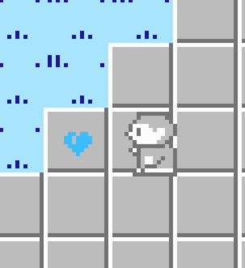
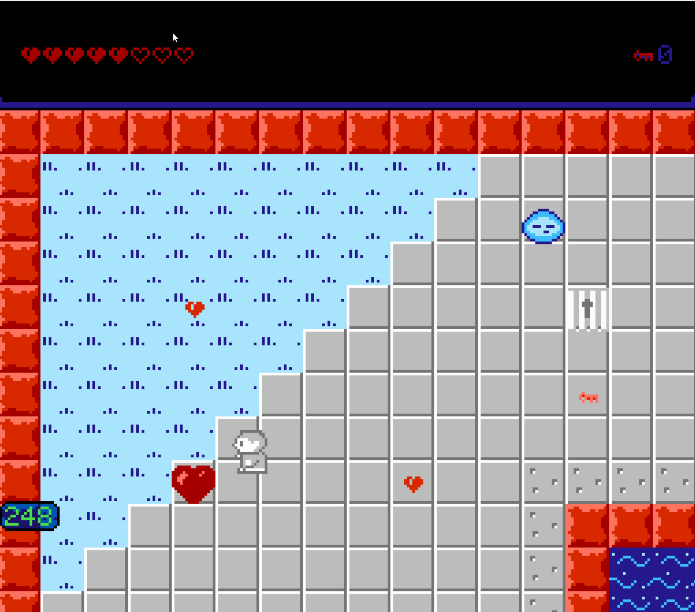

# Adding a new collectible sprite

Adding new sprites involves changing our list of available sprites, then adding some logic to handle the new sprite.
We will start simple with a new heart object, then expand on this to make it a new thing.

## Adding the new sprite object

First, let's create a new sprite. Open up `source/sprites/sprite_definitions.c`, and you should be able to see a list
of existing sprites, with one sprite per line. It looks something llke this:

```c
const unsigned char spriteDefinitions[] = {
    SPRITE_TYPE_HEALTH, 0xea, SPRITE_SIZE_8PX_8PX | SPRITE_PALETTE_2, SPRITE_ANIMATION_NONE, SPRITE_MOVEMENT_NONE, 1, 0x00, 0x00,
// ... a bunch of additional sprite definitions here...
    SPRITE_TYPE_ENDGAME, 0xe8, SPRITE_SIZE_16PX_16PX | SPRITE_PALETTE_1, SPRITE_ANIMATION_NONE, SPRITE_MOVEMENT_NONE, 0x00, 0x00, 0x00

};
```

In particular, we are interested in that first one, which is the heart sprite we can pick up to
increase our health. Let's make a new one! Copy that line at the top, and paste it at the bottom as
a new sprite. Be sure to add a comma on the line above your new one to avoid syntax errors. You will
also need to remove the comma at the end. 

A word of caution, if you add a new sprite in the middle of this list, _all of the sprites on your 
map will change as a result._ Our tools rely on the order of sprites in this file, so it's best
to always add new sprites at the end, even if the order doesn't look amazing.

Next, let's customize it a little. First, let's change the color! The current sprite uses palette 2, 
which is mostly red. This makes sense for a regular heart, but we want a super-heart, so we will use
the blue color palette. Try changing `SPRITE_PALETTE_2` to `SPRITE_PALETTE_1` - it's blue now! 

Let's make sure we can see the blue sprite next. First, we need to update the sprites that Tiled
knows about. You can run `make build-sprites` to do this instantly. (Alternatively, this is built
every time you build the game. You can just build the game instead.) If you open Tiled, you should
see the new sprite available in the `Sprites` tab. If not, try using the `reload` option in the
`file` menu.

Once you see it, we need to add the Sprite to your map. Be sure to add it to the `Sprites` layer
instead of the map layer, or it will not work. If you then rebuild your game, you should see the
new sprite on the map. If you try to collect it after taking damage, you will get one heart. 



## Making the sprite give us extra health

Alright, we have a sprite that gives us health back now, but let's customize it a little bit
more. The engine has some logic to heal the player based on the number in the first byte
reserved for miscellaneous data. (Byte 6) It is set to 1 in the first definition. Let's
up that to 2 instead! 

Open `source/sprites/sprite_definitions.c` again, and find the line you added for the blue
heart. The 6th byte should be set to 1 - change this to a 2 and save the game. Now rebuild
the game, and collect your blue heart. You should heal two hearts! Let's dig into why.

The resulting C code in `sprite_definitions.c` should look like this:
```c
SPRITE_TYPE_HEALTH, 0xea, SPRITE_SIZE_8PX_8PX | SPRITE_PALETTE_1, SPRITE_ANIMATION_NONE, SPRITE_MOVEMENT_NONE, 2, 0x00, 0x00
```

Open up `source/sprites/player.c` and look for a function called `handle_player_sprite_collision()`.
This method is called any time the engine determines that the player and a sprite are in
the same space. This function handles the sprite's response, as well as the player's. 

For example, if  the sprite is an enemy, it pushes the player back and takes away some 
health. In our case though, it adds some health back. There is a switch statement in here 
that goes through sprite types - we are concerned with `SPRITE_TYPE_HEALTH`.

Below the type, there is some code that changes the player health, and also removes
the sprite from the screen. You can tweak this code to heal the player more, or
never make the sprite go away if you want. We'll expand on this to make our own
new type of collectible sprite!

## Making the sprite change our max health

Okay, we made a heart that heals more than 1 damage, but let's take it a little bit
further. Why don't we make this sprite increase the player's max health, so that they
can take one more heart of damage!

Based on seeing the logic above, we probably want to create a new sprite type - we 
could use the `SPRITE_TYPE_HEALTH` type, but this would make the code kind of confusing.

Open up `source/sprites/sprite_definitions.h` and look for a bunch of definitions starting
with SPRITE_TYPE. There should be something like this: 

```c
#define SPRITE_TYPE_NOTHING 0x00
#define SPRITE_TYPE_KEY 0x01
#define SPRITE_TYPE_HEALTH 0x02
#define SPRITE_TYPE_REGULAR_ENEMY 0x03 
#define SPRITE_TYPE_DOOR 0x04
#define SPRITE_TYPE_ENDGAME 0x05
```

These simply map pretty names to values that the code knows about. Add a new one for
this sprite called `SPRITE_TYPE_LIFE_UP`, and give it a value not taken by another 
SPRITE_TYPE variable - in this example, you could use `0x10`. 

Now, we need to have our sprite definition use that variable. Here it is from before:

```c
SPRITE_TYPE_HEALTH, 0xea, SPRITE_SIZE_8PX_8PX | SPRITE_PALETTE_1, SPRITE_ANIMATION_NONE, SPRITE_MOVEMENT_NONE, 2, 0x00, 0x00
```

We want to change `SPRITE_TYPE_HEALTH` to `SPRITE_TYPE_LIFE_UP`. While we are at it, let's
make the sprite a little bit more unique! If we look at nesst for our sprites, there is
a big heart sprite at `0xec`. If we change the sprite id (second byte) to this, we can 
use that big heart sprite. However, our old sprite was 8x8 pixels in size, and this new 
one is 16x16. We also need to update the size of the sprite, by changing 
`SPRITE_SIZE_8PX_8PX` to `SPRITE_SIZE_16px_16px`. Lastly, let's make the color red again,
using `SPRITE_PALETTE_2`. The end result should look like this: 

```c
SPRITE_TYPE_LIFE_UP, 0xec, SPRITE_SIZE_16PX_16PX | SPRITE_PALETTE_2, SPRITE_ANIMATION_NONE, SPRITE_MOVEMENT_NONE, 2, 0x00, 0x00
```

If you rebuild the game at this step, you should see your new heart sprite in use!
Tiled should also show the new image after the game is built. You may notice that
nothing happens when you try to collect the sprite though - that's our next step!



In the last section, we looked at the logic in `source/sprites/player.c`, which 
handles sprite collision. We need to delve back into that code to make this logic
work for our new case. Open that file back up, and find the section that handles
`SPRITE_TYPE_HEALTH`. We want to add some new logic for `SPRITE_TYPE_LIFE_UP`.

Here's what the code looks like now: 

```c
switch (currentMapSpriteData[(currentMapSpriteIndex) + MAP_SPRITE_DATA_POS_TYPE]) {
    case SPRITE_TYPE_HEALTH:
        // ... implementation of sprite health stuff here...
        break;
    case SPRITE_TYPE_KEY:

```

Let's add a new case for `SPRITE_TYPE_LIFE_UP` between `SPRITE_TYPE_HEALTH` and 
`SPRITE_TYPE_KEY`. Player health is controlled by a global variable called 
`maxPlayerHealth`, so we will need to change that. There is also a line of code
that hides the sprite in the `SPRITE_TYPE_HEALTH` method that we can reuse here.

The end result is something like this: 

```c
switch (currentMapSpriteData[(currentMapSpriteIndex) + MAP_SPRITE_DATA_POS_TYPE]) {
    case SPRITE_TYPE_HEALTH:
        // ... implementation of sprite health stuff here...
        break;
    case SPRITE_TYPE_LIFE_UP:
        playerMaxHealth += 1;
        // Hide the sprite now that it has been taken.
        currentMapSpriteData[(currentMapSpriteIndex) + MAP_SPRITE_DATA_POS_TYPE] = SPRITE_TYPE_OFFSCREEN;
        break;
    case SPRITE_TYPE_KEY:

```

If you rebuild the game and collect your new sprite, you should see the player's
max health increase, and be able to collect hearts to fill it up!