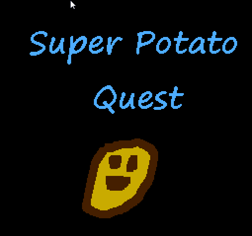
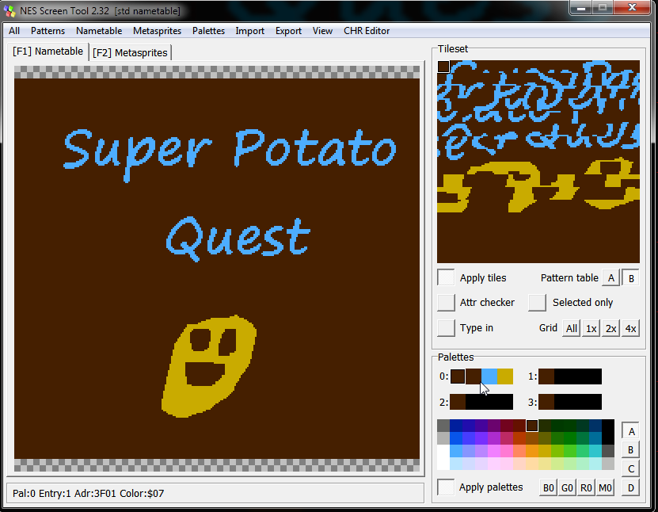
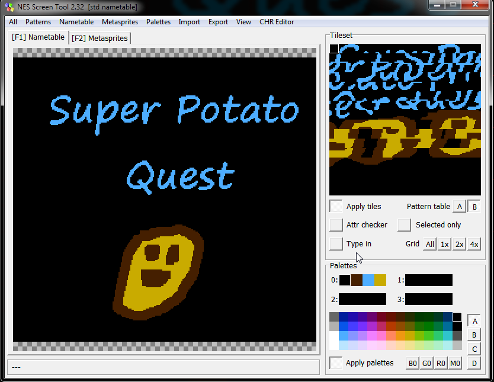
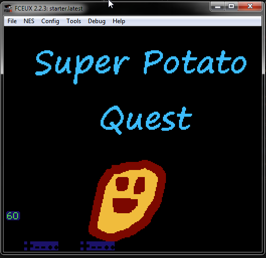

# Making a Full Title Screen

**Note**: _This change exists in a branch on Github. 
[Click here](https://github.com/cppchriscpp/nes-starter-kit/compare/custom_title) 
to view the changes in the branch, or do `git checkout custom_title` with a local
copy of the repo to view the code._

Okay, you're getting pretty far with your game, but the text-based title screen
isn't quite cutting it. There are better options if you have a bit of time, and some
artistic skill! 

We will start by drawing a new title screen in a paint program, then import it into
NES Screen Tool, then finally alter the code to draw the new screen.

## Creating a new title screen

There are a few ways you can go about this, all with their pros and cons. At the end of the day,
our goal is to get an image into NES Screen Tool that it understands. 

### Using NES Screen Tool by itself

The simplest way to do this is to simply use NES Screen Tool to create the entire image. This is
likely feasible for simple title screens - especially if you are going to reuse some of the tiles
in another of your chr files. If you choose to do that, open the chr file you are interested in,
and save it _to a new chr file before moving on_. In the example, I stored it in 
`graphics/static/title.chr`. 

Now, open NES Screen tool (if you haven't already), and create a few tiles on the left.


This time, we're going to focus on the left panel, also known as the `Nametable`. This is
basically a screen on the NES, which we can directly place into your game with a little work.
If you select a tile on the right, then click in the nametable, that tile will be placed in.

It will also apply the selected palette to that tile on click - with one caveat. The "Tiles" in 
NES Screen Tool are 8 pixels by 8 pixels, but the NES only supports showing one color every
4 tiles. This is one of the reasons we use 16 pixel by 16 pixel tiles in our engine.

**Tip**: You can select a larger section of your chr tiles to put onto the nametable by holding 
shift and dragging the mouse around.

Once you have a decent looking title, skip to the section below titled "Saving the files from
NES Screen Tool". 

### Using GIMP (or another image editor)

If the stuff above sounds too complicated, you have another option. NES Screen Tool has the
ability to import .bmp files, and break them up into tiles and a nametable for you! 

Before you get too excited, keep in mind you are still restricted to NES limitations. In addition,
NES Screen Tool is (sadly) only really capable of importing an image with **one four-color palette**.
You can tweak the image further (and use the other 3 palettes) within NES Screen Tool.

To start, open your image editor (I am using GIMP) and create a new image that is `256x240` pixels
in size. If you are using GIMP, you also may want to import 
[this palette](https://gist.github.com/saintedlama/2d713a4edaf4c249d39ef5c6cff2a828#file-nes-gpl)
by right-clicking on the palette panel and choosing "Import Palette". 

Now, just create your image using 4 colors. An example .bmp file is in the `graphics/static` folder
in the `custom_title` git branch. Once you're reasonably happy with it, export it as a 16 color
bitmap. 

In GIMP, you can do this by going to the "Image" menu, and selecting "mode -> indexed...". From there,
choose "Generate optimum palette" and choose a max colors of 16. Now, hit Convert. Okay, now we can
save the file. Go to "File" then "Export". When you get the prompt, make sure to save it with a 
`.bmp` extension. Use the defaults if a special dialog pops up.

Here's the image I created for this (available in the branch as `graphics/static/potatoquest.bmp`)



### Converting an image with NES Screen Tool

Open NES Screen Tool back up, using a new window if you have any work in progress. (This will destroy
your palettes, tiles, and nametable) Go to the "Import" menu, and select "BMP File as Nametable".
Now, find the file you saved in the last section. Open it up and...



Well, that's not quite right! You may notice that your colors are off slightly - NES Screen Tool seems
to have a bug where it mixes up the first color in your palette with a later one. Click the far left
color in your palettes, and set it to the correct color. This should fix things.



### Saving the files from NES Screen Tool

Now, we just need to save everything that makes it up. That is, we need to save the palette, the chr
tiles, and the nametable itself. I found it easiest to save them all to one folder, and did this in the
example.

First, save the chr tiles by going to the Patterns menu, then choosing Save -> "4K (Current Bank)". 
I saved mine to `graphics/static/title.chr`. 

Next, save the palette by going to the Palettes menu, then choosing "Save Palettes". I saved mine
to `graphics/static/title.pal`.

Finally, save the nametable by going to the Nametable menu and choosing "Save Nametable and Attributes".
When the file selector shows up, _select **RLE packed Binary (*.rle)** from the "Save as Type" thing_.
I saved mine to `graphics/static/title.rle`.

## Adding the title to your game

Alright, we managed to get together an image. Just need to code up the solution to draw them. Thankfully,
this part isn't super crazy. I strongly suggest looking at the code in 
[the branch](https://github.com/cppchriscpp/nes-starter-kit/compare/custom_title) to follow along.

First, we need to create a couple files to make this data accessible to the game. (Note: yes, you're
technically going to touch two assembly files here. I promise I'll explain it carefully, and you
should be able to get by with just copy/pasting most things!) 

Create a new file as `graphics/static/custom_title_assets.asm`, and fill it out with the contents 
from the git branch. This file is responsible for loading the data we created into memory, and telling
our C code where it lives. Further detail is in the code. Of special note, we declare the code bank
in here, like we do with `CODE_BANK()` in C code. If you change the value in the .h file, you will
need to change it here too.

Next, we need to tell the game to load this file. This is done in our crt0 file, which is the entry
point for our C code. It does a bunch of system setup. Open `source/neslib_asm/crt0.asm` - towards
the bottom you should see a bunch of `.include` statements. Like this: 

```asm
    .include "source/library/bank_helpers.asm"
 	.include "source/neslib_asm/neslib.asm"
 	.include "source/graphics/palettes.asm"
```
Add a reference to our new file after this: 
```asm
+	.include "source/graphics/static/custom_title_assets.asm" 
```

While we're in here, we also need to put our chr data somewhere. This is all done about 20 lines
lower in our `crt0.asm` file. Look for some code like this: 

```asm
 .segment "CHR_00"
 
 	; We just put the ascii tiles into both sprites and tiles. If you want to get more clever you could do something else.
 	.incbin "graphics/ascii.chr"
 .segment "CHR_01"
	.incbin "graphics/tiles.chr"
```

After a few lines, you will see us start to repeat the same `graphics/tiles.chr` file repeatedly, 
just to fill up space. Pick one of these and replace the file with our new one, which is
`graphics/static/title.chr`. Take note of which one you replace (I used CHR_03) as you will need
it again in a moment.

Next, we need to add a header file, which will tell our C code how to reference this data and
use it to draw. Create a new file: `source/graphics/static/custom_title_assets.h`. This is
a really short one: 

```c
// These reference raw data we use to load our custom title page
// They are created in the .asm file with the same name.

extern const unsigned char custom_title_palette[16];

extern const unsigned char custom_title_nametable_rle[]; 
```

This just creates two variables that reference the two things we created in the
assembly file above. If we include this header, we'll start seeing that data
as if it were regular C data. Cool, right?

Next, we need to put together some code to actually draw the title. It's pretty
similar to the title code we already have, but uses the `vram_unrle` method to
load the nametable data. First, create a header file to describe the new methods.

Create `source/graphics/static/custom_title.h`, and add the following code:

```c
#define PRG_BANK_CUSTOM_TITLE 4
#define CHR_BANK_CUSTOM_TITLE 3

void draw_custom_title();

void handle_custom_title_input(); 
```

The two bank `#define`s at the top may need to change if you didn't use the defaults. 
The `PRG_BANK_CUSTOM_TITLE` tells us which bank the code is in. This needs to be the
same as what is in `source/graphics/static/custom_title_assets.asm`. Similarly,
`CHR_BANK_CUSTOM_TITLE` needs to be the same as what we set in `crt0.asm`.

Alright, that's done, now we need some code to draw the title, and also handle 
input. This code should mostly look familiar, and as such I won't go over it. (There
are still plentiful comments in-line. Create a file called 
`source/graphics/static/custom_title.c` and fill it with the contents from the
git branch.


Okay, almost done! All that's left is hooking it into our game code. If you open
`source/main.c`, you should be able to find where we draw the title now. Look
for some code like this: 

```c
case GAME_STATE_TITLE_DRAW:
    banked_call(PRG_BANK_TITLE, draw_title_screen);
    music_play(SONG_TITLE);
    fade_in();
    break; 
case GAME_STATE_TITLE_INPUT:
    banked_call(PRG_BANK_TITLE, handle_title_input);
    break; 
```

All we need to do is change both of these to use the `PRG_BANK_CUSTOM_TITLE` 
constant we created, as well as the `draw_custom_title` and 
`handle_custom_title_input` methods. The result will look like this: 

```c
case GAME_STATE_TITLE_DRAW:
    banked_call(PRG_BANK_CUSTOM_TITLE, draw_custom_title);
    music_play(SONG_TITLE);
    fade_in();
    break; 
case GAME_STATE_TITLE_INPUT:
    banked_call(PRG_BANK_CUSTOM_TITLE, handle_custom_title_input);
    break; 
```
The only thing that is left is including our header file. If you scroll to
the very top of the file, you will see a large list of include files. We need
to add ours, like this: 

```c
#include "source/graphics/static/custom_title.h"
```

Okay, that's everything! Rebuild your game, and if everything went well, you
should be looking at your new title!



[View the git branch](https://github.com/cppchriscpp/nes-starter-kit/compare/custom_title)

[Download the test rom](https://s3.amazonaws.com/nes-starter-kit/custom_title/starter.latest.nes)